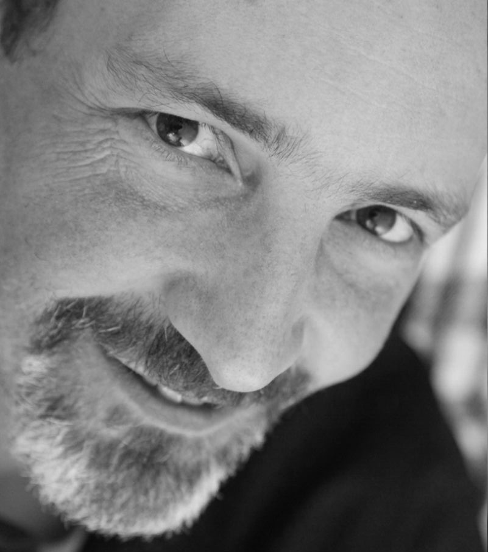

# Ernesto Nicola's Biography

Ernesto Nicola was born in Argentina, but now lives in Mallorca (Spain). Before coming to Mallorca, he lived a number of years in Germany, Spain and Sweden.

He got a Doctor of Physics (PhD) degree from the [Max Plank Institute for Physics of Complex Systems][MPIPKS] in Dresden (Germany) and a Master in Physics at [Instituto Balseiro][IB] in Bariloche (Argentina). He also worked as a professor and researcher in a number of universities and research institutes in Germany and Spain:
* [Technische Universität Dresden][TUD] (Germany),
* [Technische Universität Berlin][TUB] (Germany),
* [Universität Bayreuth][UBay] (Germany),
* [University of Barcelona][UB] (Spain), and
* [University of the Balearic Islands][UIB] (Spain; at [IFISC: Institute of Interdisciplinary Physics and Complex Systems][IFISC]).

He has been a passionate amateur astronomer since a number of years. He has special interest in the popularization of the astronomy and astrophysics. During the last years he has given many talks, seminars and courses in astronomy within [AstroMallorca][AM] (the amateur astronomy association of Mallorca).

[MPIPKS]:https://www.pks.mpg.de/
[UB]:https://www.ub.edu/portal/web/fisica
[UIB]:https://www.uib.eu/
[IFISC]:https://ifisc.uib-csic.es/es/
[UBay]:https://www.physik.uni-bayreuth.de/en/
[TUB]:https://www.physics.tu-berlin.de/
[TUD]:https://tu-dresden.de/mn/physik
[IB]:https://www.ib.edu.ar/
[AM]:https://astromallorca.wordpress.com/
